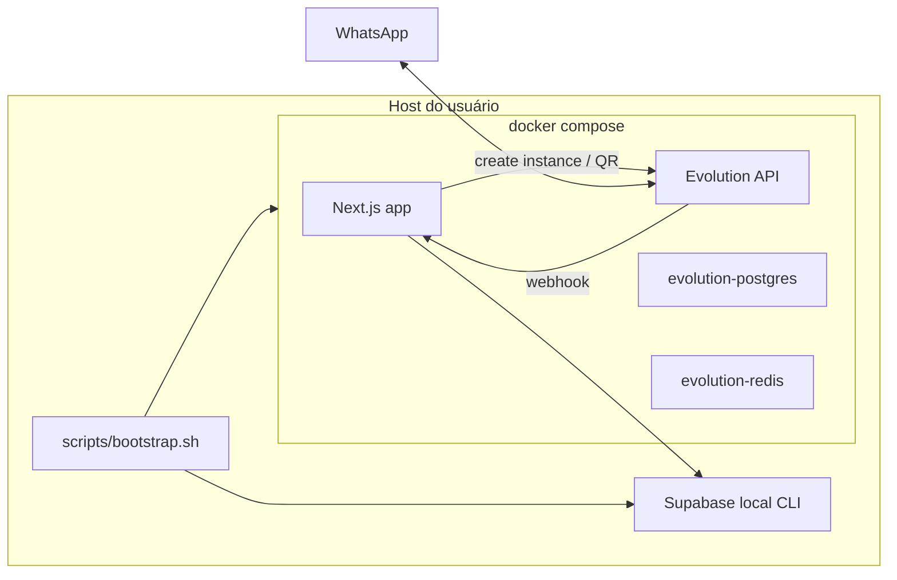
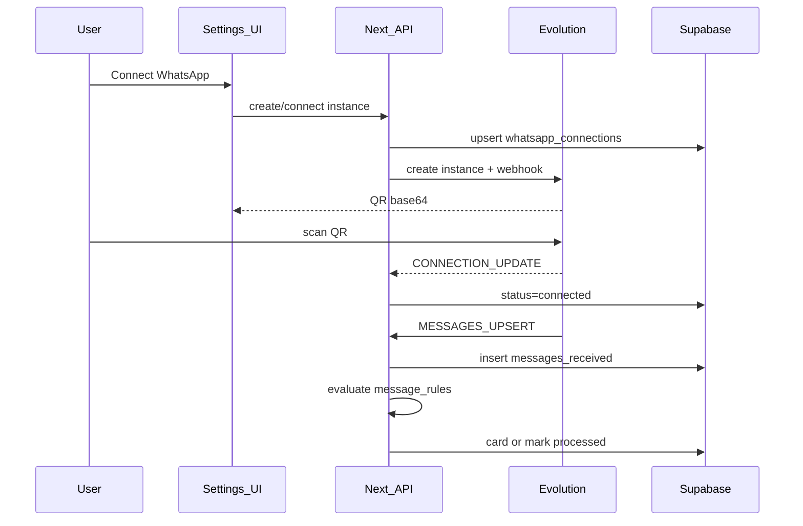

# PRD: Evolution API no PersonalOS (OSS clone-and-run)

| Campo | Valor |
|-------|--------|
| **Status** | Draft |
| **Autor** | PersonalOS |
| **Data** | 2026-08-02 |
| **Escopo** | Embarcar Evolution API + fechar caminho WhatsApp first-party |
| **Público** | Self-hosters / contribuidores open-source |

---

## 1. Problema

O PersonalOS já tem domínio de regras de WhatsApp (compose em linguagem natural, Focus cards, contatos, grupos), mas **não entrega o runtime WhatsApp**. Hoje:

- A app só faz CRUD de regras em Supabase.
- Ingestão e avaliação dependem de um pipeline externo: Evolution API → n8n → Supabase (`integrations/whatsapp-n8n/README.md`).
- Não existe `Dockerfile`, `docker-compose.yml`, cliente Evolution, UI de QR nem webhook na aplicação.

Para um projeto open-source cujo valor é “gerenciar o WhatsApp do dia a dia de trabalho”, isso quebra a promessa: a pessoa baixa o repo e **ainda precisa montar Evolution + n8n + wiring manual** antes de usar.

---

## 2. Objetivo do produto

Permitir que qualquer pessoa:

1. Clone o repositório.
2. Execute um bootstrap (script + Docker Compose).
3. Crie uma conta na própria app.
4. Escaneie o QR code da Evolution API na UI.
5. Conecte o WhatsApp pessoal.
6. Comece a usar regras → Focus sem configurar n8n.

**One-liner:** *Baixe, suba, escaneie o QR, use.*

### Não-objetivos (MVP)

- SaaS multi-tenant com billing / control plane.
- WhatsApp Cloud API oficial (Meta) como adapter default.
- Substituir Supabase por outro banco.
- Incluir n8n no caminho crítico do produto.
- Stack 100% Docker incluindo Supabase completo (fica para fase posterior).

---

## 3. Personas e contexto de uso

| Persona | Necessidade |
|---------|-------------|
| **Profissional sobrecarregado** | Filtrar WhatsApp de trabalho/família e virar cards no Focus sem n8n. |
| **Self-hoster OSS** | `git clone` + um comando; poucos env vars; documentação clara. |
| **Contribuidor** | Contrato de ingest/regras no repo; sem depender de workflow n8n fora do código. |

**Modelo de uso default:** um operador pessoal por host. O data model continua multi-tenant por `user_id` (uma instância WhatsApp por usuário), mas a UX OSS assume single-user.

---

## 4. Estado atual (baseline)

| Área | Realidade |
|------|-----------|
| Auth | Auth.js (NextAuth v5) email/password; signup bloqueado quando `NODE_ENV=production` (`lib/security/signup.ts`) |
| Dados | Supabase Postgres (`next_auth` + `app`); multi-tenant por `user_id` |
| WhatsApp | Contrato documental apenas; n8n avalia regras e cria cards |
| Deploy doc | Cloud Supabase + Render; sem compose |
| UI | Focus, contacts, rules, settings — **sem** conexão WhatsApp/QR |

Domínio já preparado: `app.messages_received`, `app.message_rules` (schema v3), `app.whatsapp_groups.external_group_id`, `app.important_contacts`.

---

## 5. Decisões de produto / arquitetura (fechadas)

| Decisão | Escolha | Rationale |
|---------|---------|-----------|
| Evolution no compose | Sim — imagem oficial pinada + Postgres + Redis | QR e sessão no mesmo repo |
| n8n no caminho crítico | **Não** — avaliador first-party na app | Self-hosters não devem montar workflows para obter valor |
| n8n no repo | README opcional / path avançado | Power users não perdem o contrato |
| Banco da app (MVP) | Supabase local via CLI (`supabase start`) | Reusa migrations e `@supabase/supabase-js` |
| Compose (MVP) | `app` + Evolution + deps | Menor complexidade que stack Supabase completa |
| Signup self-host | `ALLOW_SIGNUP=true` | Produção Docker precisa criar a primeira conta |
| Chaves Evolution | Server-only | Nunca no browser |

---

## 6. Experiência desejada (user journey)

### 6.1 Bootstrap

1. Usuário clona o repo e copia `.env.example` → `.env.local` (ou o bootstrap gera o essencial).
2. Roda `./scripts/bootstrap.sh` (ou equivalente documentado).
3. Script: sobe Supabase local → injeta URL/keys → `docker compose up -d`.
4. Abre a app, cria conta (`ALLOW_SIGNUP`), entra.

### 6.2 Conectar WhatsApp

1. Em Settings → “Connect WhatsApp”.
2. App cria/associa instância Evolution ao `user_id` e configura webhook.
3. UI exibe QR (base64) e estado (`pending` / `connected` / `disconnected`).
4. Usuário escaneia no WhatsApp; webhook `CONNECTION_UPDATE` marca `connected` + `phone_jid`.

### 6.3 Mensagem → Focus

1. Mensagem chega no WhatsApp → Evolution → `POST /api/webhooks/evolution`.
2. App valida secret, resolve `instance` → `user_id`, normaliza e grava `messages_received`.
3. Avaliador first-match aplica `message_rules` (mesmo contrato do README n8n).
4. `create` → card no Daily Focus; `ignore` / sem match → só marca processado.

---

## 7. Requisitos funcionais

### RF-01 — Infraestrutura clone-and-run

- **RF-01.1** `Dockerfile` multi-stage para a app Next.js.
- **RF-01.2** `docker-compose.yml` com serviços: `app`, `evolution-api`, `evolution-postgres`, `evolution-redis`.
- **RF-01.3** Volumes persistentes para sessão Evolution (reconnect sem novo QR após recreate controlado).
- **RF-01.4** Script `scripts/bootstrap.sh`: `supabase start` → env → `docker compose up -d`.
- **RF-01.5** `.env.example` documenta: `EVOLUTION_API_URL`, `EVOLUTION_API_KEY`, `EVOLUTION_WEBHOOK_SECRET`, `ALLOW_SIGNUP`, além das vars Auth/Supabase/OpenAI existentes.
- **RF-01.6** README com caminho one-command e avisos de risco (WhatsApp não-oficial).

### RF-02 — Persistência de conexão

- **RF-02.1** Tabela `app.whatsapp_connections` com pelo menos: `user_id` (UNIQUE), `instance_name`, `status`, `phone_jid`, timestamps.
- **RF-02.2** Cascade / limpeza coerente com delete de usuário.
- **RF-02.3** Idempotência de ingest: identificador externo da mensagem Evolution com unique constraint (retries não duplicam cards).

### RF-03 — Cliente e UI de conexão

- **RF-03.1** Módulo `features/whatsapp/` com cliente Evolution **server-only**.
- **RF-03.2** Actions autenticadas: criar/conectar instância, obter QR, status, desconectar.
- **RF-03.3** UI em Settings: QR + estado da conexão (poll ou refresh leve).
- **RF-03.4** Browser nunca recebe `EVOLUTION_API_KEY` nem `SUPABASE_SERVICE_ROLE_KEY`.

### RF-04 — Webhook e avaliação de regras

- **RF-04.1** `POST /api/webhooks/evolution` com validação de secret compartilhado.
- **RF-04.2** Eventos mínimos: `CONNECTION_UPDATE`, `MESSAGES_UPSERT` (ou equivalentes da versão pinada).
- **RF-04.3** Insert em `app.messages_received` com `user_id` NOT NULL e campos já exigidos pelo contrato.
- **RF-04.4** Avaliador first-match portado de `integrations/whatsapp-n8n/README.md` (schema v3): condições determinísticas + `theme_any` opcional via `OPENAI_API_KEY` (fail-closed se LLM falhar).
- **RF-04.5** Ações `create` / `ignore` / sem match escritas como no contrato atual (card + `processed`).
- **RF-04.6** Classificação gravada com `evaluator` first-party (ex.: `personalos@3`), não `n8n@3`.

### RF-05 — Auth self-host

- **RF-05.1** Flag `ALLOW_SIGNUP` permite signup mesmo com `NODE_ENV=production` quando self-host.
- **RF-05.2** Comportamento atual em cloud/Render (signup off) permanece o default se a flag não estiver setada.

### RF-06 — Compatibilidade

- **RF-06.1** Tabelas e UI de rules/contacts/Focus existentes continuam válidas.
- **RF-06.2** Path n8n permanece documentado como opcional; default do produto é first-party.

---

## 8. Requisitos não-funcionais

| ID | Requisito |
|----|-----------|
| **RNF-01** | Tempo até “QR na tela” após bootstrap saudável: documentado e razoável em máquina de desenvolvedor (ordem de minutos, não horas de config manual). |
| **RNF-02** | Webhook não pode ser aberto: secret obrigatório; rate-limit recomendado. |
| **RNF-03** | Avaliação com `theme_any` não deve travar o webhook indefinidamente; se necessário, processar async (`processed=false` + worker) — preferência MVP: sync com timeout curto; async se timeouts forem comuns. |
| **RNF-04** | Pin de versão da imagem Evolution; notas de upgrade no README. |
| **RNF-05** | Secrets nunca commitados; `.env.local` no `.gitignore`. |
| **RNF-06** | Divulgação clara de risco de ban / ToS WhatsApp e licença Evolution (tipicamente Apache-2.0 upstream). |
| **RNF-07** | i18n EN/PT para strings novas de conexão WhatsApp (padrão do projeto). |

---

## 9. Arquitetura alvo (MVP)

### Rede e persistência

| Serviço | Papel | Persistência |
|---------|-------|--------------|
| `app` | UI, API, webhook, rules engine | Stateless |
| `evolution-api` | Instâncias, QR, webhooks | Volume de sessões |
| `evolution-postgres` | Metadata Evolution | Volume |
| `evolution-redis` | Cache/fila Evolution | Volume |
| Supabase local (host/CLI) | DB/API da app | Volumes Supabase |

Webhook Evolution → `http://app:3000/api/webhooks/evolution` (rede Docker interna).

---

## 10. Fluxo detalhado (QR → Focus)

---

## 11. Critérios de aceite (MVP)

1. Em máquina limpa (com Docker + Supabase CLI + deps documentadas), seguir o README resulta em app acessível sem montar n8n.
2. Usuário consegue signup self-host com `ALLOW_SIGNUP=true`.
3. Em Settings, consegue gerar QR e, após scan, ver status `connected`.
4. Mensagem de teste (DM ou grupo conforme regra) gera card no Daily Focus **ou** é ignorada conforme regra, sem n8n.
5. Retry do mesmo webhook não cria card duplicado.
6. Reiniciar containers Evolution **com volumes** não exige novo QR imediatamente (sessão preservada).
7. README menciona riscos de conta WhatsApp / API não-oficial.
8. `EVOLUTION_API_KEY` não aparece em bundle client / Network do browser.

---

## 12. Fora de escopo / roadmap posterior

| Fase | Itens |
|------|--------|
| **Next** | Sync grupos Evolution → `app.whatsapp_groups`; hardening de assinatura webhook; retention de mídia; health/status page; profile compose opcional com n8n |
| **Later** | Compose-only com stack Supabase completa; multi-instância / family sharing; ações outbound no WhatsApp; adapter WhatsApp Cloud API oficial atrás da mesma porta de domínio |

---

## 13. Riscos e mitigações

| Risco | Mitigação |
|-------|-----------|
| Ban / ToS WhatsApp (Baileys) | Disclaimer no README e na UI de conexão; não posicionar como integração Meta |
| Perda de sessão | Volumes nomeados no compose; doc de backup |
| Webhook aberto / abuso | Secret + (desejável) rate-limit; sem service_role no client |
| LLM timeout em `theme_any` | Fail-closed; OpenAI opcional; async se necessário |
| Drift de versão Evolution | Pin de tag; changelog de upgrade |
| Expectativa “só docker compose” sem CLI | Documentar pré-requisito Supabase CLI no MVP; fase later para compose-only |

---

## 14. Ordem de entrega sugerida

1. Compose + Dockerfile + bootstrap + env
2. Migration `whatsapp_connections` + idempotência de message id
3. Cliente Evolution + actions + UI QR
4. Webhook + avaliador de regras first-party
5. `ALLOW_SIGNUP` + README OSS

---

## 15. Métricas de sucesso (produto OSS)

- Tempo mediano de um self-hoster do clone até primeiro card gerado por regra (qualitativo no MVP: “mesmo dia / < 30 min de setup”).
- Issues de setup (env/compose/QR) vs issues de domínio — tendência de queda nas primeiras.
- Uso do path n8n deixa de ser pré-requisito documentado no README principal.

---

## 16. Referências internas

- Contrato atual de regras: `integrations/whatsapp-n8n/README.md`
- Signup: `lib/security/signup.ts`
- Settings: `app/(app)/settings/page.tsx`
- Env: `.env.example`, `lib/config/env.ts`
- Setup atual: `README.md`
